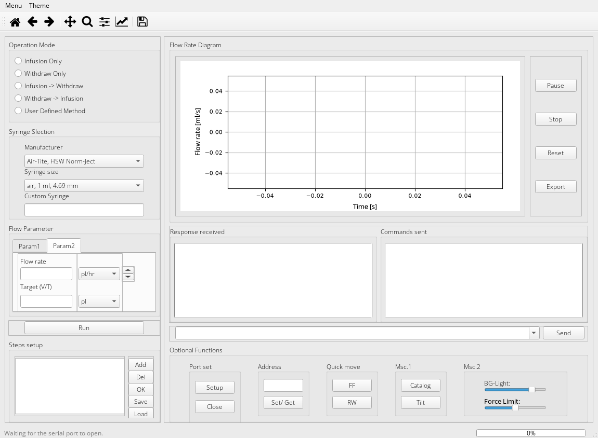
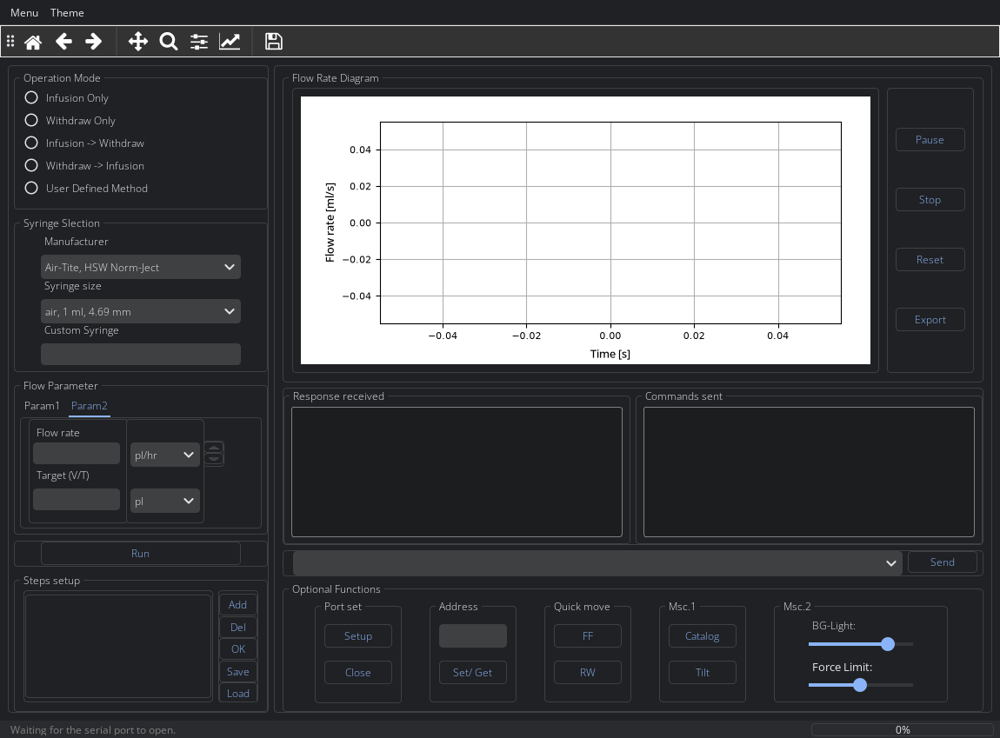
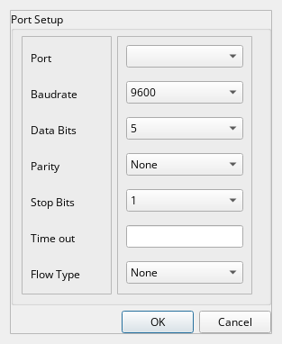
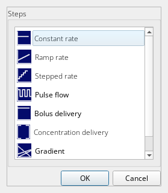

# Harvard Apparatus PHD Ultra Series Remote Control GUI

[](https://www.python.org/)
[](https://www.riverbankcomputing.com/software/pyqt/)
[](LICENSE)
[](https://www.harvardapparatus.com/)

A modern, thread-safe desktop application written in **Python** and **PyQt6** for remote serial control and real-time monitoring of **Harvard Apparatus PHD Ultra 70-3xxx Series** syringe pumps.

---

## Table of Contents

- [Overview](#overview)
- [Key Features](#key-features)
- [Hardware & Serial Interface](#hardware--serial-interface)
- [Screenshots](#screenshots)
- [Project Architecture](#project-architecture)
- [Installation & Quickstart](#installation--quickstart)
- [Packaging Standalone Executable](#packaging-standalone-executable)
- [Testing](#testing)
- [Author & Affiliation](#author--affiliation)
- [License](#license)

---

## Overview

The **Harvard Apparatus PHD Ultra** (70-3xxx series) represents the gold standard in high-accuracy laboratory syringe pumping, widely deployed in microfluidics, chemical synthesis, and rheological research. 

This application provides an intuitive graphical user interface (GUI) to replace manual keypad configuration with automated, reproducible experiment workflows:
- **Full Bidirectional Communication**: Send standard and advanced Harvard ASCII commands and parse asynchronous pump responses.
- **Quick Mode Operation**: Direct Infusion, Withdrawal, and Dual-Phase Continuous Pumping (`INF/WD` and `WD/INF`).
- **User-Defined Multi-Step Methods**: Build, inspect, import, and export complex pump sequences composed of Constant, Ramp, Stepped, Pulse, Bolus, Concentration, Gradient, and Autofill steps.
- **Real-Time Data Visualization**: Embedded Matplotlib canvas plotting instantaneous flow rate and accumulated volume over elapsed time.
- **Hardware Protection**: Integrated syringe catalog that automatically calculates permissible flow limits and recommends motor force levels to protect glass syringes and high-pressure tubing.

---

## Key Features

1. **Quick Start Mode**
   - Single-target infusion (`INF`) or withdrawal (`WD`).
   - Automated sequential dual-phase cycles: Continuous Infusion then Withdrawal (`INF/WD`), or Continuous Withdrawal then Infusion (`WD/INF`).
   - Dynamic unit conversions across $\text{pl/s}$, $\text{nl/s}$, $\mu\text{l/s}$, $\text{ml/s}$, $\text{nl/min}$, $\mu\text{l/min}$, $\text{ml/min}$, $\mu\text{l/hr}$, and $\text{ml/hr}$.

2. **Custom Method Sequence Builder**
   - Configure complex sequences with step types:
     - `Constant`: Constant rate delivery to target volume or time.
     - `Ramp`: Linear flow rate gradient ($r_{\text{start}} \to r_{\text{end}}$).
     - `Stepped`: Stepwise multi-rate profiles.
     - `Pulse`: Periodic intermittent dosing pulses.
     - `Bolus`: High-precision micro-bolus injections.
     - `Concentration`: Body-weight or volume-normalized dosage.
     - `Gradient`: Multi-pump proportional mixing.
     - `Autofill`: Continuous reciprocating refill and delivery.
   - Native JSON export and import (`UserDefinedMethods/`) for experiment repeatability.

3. **Real-time Telemetry & Dynamic Plotting**
   - Embedded Qt Matplotlib canvas (`GraphicalMplCanvas`) rendering live flow rate and volume curves.
   - Telemetry export to tab-delimited text (`.txt`) for post-processing in Origin, MATLAB, or Python.

4. **Syringe Database & Safety Guardrails**
   - Pre-loaded database covering major manufacturers: Hamilton (Gastight & Microliter), BD (Plastipak & Glass), Popper & Sons, Cadence Science, Air-Tite, HSW Norm-Ject, and Ranfac.
   - Automated minimum and maximum flow rate calculation based on syringe inner diameter and lead-screw pitch.
   - Force limit recommendation slider ($20\% - 100\%$) with warning tooltips to prevent mechanical damage to fragile syringes.

5. **Robust Concurrency & Serial Engine**
   - Asynchronous serial worker (`phd_ultra.core.serial_worker`) using `threading.RLock()` to prevent port contention and deadlocks.
   - Pure Qt signal-slot communication keeping the GUI responsive at all times.
   - Resilient automatic reconnection upon physical cable disconnection.

6. **Modern Usability & System Integration**
   - Multi-theme support: Default native theme, Light theme, and Dark theme powered by `pyqtdarktheme`.
   - Global emergency hotkey (`Ctrl + G`) to immediately halt pump motion from any active application.
   - System tray integration with background minimization and clean application teardown.

---

## Hardware & Serial Interface

### Connection Specifications

| Parameter | Default Value | Configurable Range |
|---|---|---|
| **Interface** | RS-232 (DB9) / USB-B (Virtual COM Port) | COM1 - COM256 |
| **Baud Rate** | `9600` | 9600, 19200, 38400, 57600, 115200, Custom |
| **Data Bits** | `8` | 7, 8 |
| **Parity** | `None` (`N`) | None (`N`), Even (`E`), Odd (`O`), Mark (`M`), Space (`S`) |
| **Stop Bits** | `1` | 1, 1.5, 2 |
| **Flow Control**| `None` | None, Hardware RTS/CTS, Software XON/XOFF |
| **Pump Address**| `00` | `00` to `99` (Multi-pump daisy chain) |
| **Line Ending** | `\r\n` (CR + LF) | None, `<cr>`, `<lf>`, `<cr><lf>` |

### RS-232 / USB Pinout Note
- When using the native RS-232 9-pin D-sub port, ensure a straight-through serial cable or a standard FTDI USB-to-RS232 adapter is connected.
- For daisy-chained setups, connect the master pump via RS-232/USB and use standard RJ-11 daisy chain cables between subsequent pump addresses.

---

## Screenshots

| Main Window (Light Theme) | Main Window (Dark Theme) |
| :---: | :---: |
|  |  |

| Serial Port Configuration | Custom Method Steps Selector |
| :---: | :---: |
|  |  |

---

## Project Architecture

```text
PHD-Ultra-Series-Remote-Control-GUI-PyQt6-/
├── assets/                     # Application icons and vector branding
│   ├── icon.ico
│   ├── icon.png
│   └── logo.svg
├── docs/                       # High-resolution documentation screenshots
│   └── images/
├── json/
│   └── commands.json           # Harvard Apparatus command protocol & syringe catalog
├── phd_ultra/                  # Modular Python package
│   ├── config/                 # Safe directory path & logging initializers
│   ├── core/                   # Thread-safe serial worker & command dispatching
│   │   ├── commands.py
│   │   └── serial_worker.py
│   ├── database/               # Syringe dimension library & force calculations
│   │   └── syringes.py
│   ├── ui/                     # UI components, dialogs, canvas & theming
│   │   ├── canvas.py
│   │   ├── controllers.py
│   │   ├── dialogs.py
│   │   ├── theme.py
│   │   └── tray.py
│   └── utils/                  # Input validators & JSON method serialization
│       ├── method_io.py
│       └── validators.py
├── tests/                      # Automated unit and offscreen GUI regression tests
├── functions.py                # Backward-compatibility facade bridging legacy code
├── main.py                     # Main application entry point
├── main.spec                   # Standalone PyInstaller build specification
├── pyproject.toml              # PEP 517/621 packaging metadata
├── requirements.txt            # Python dependencies
└── README.md
```

---

## Installation & Quickstart

### 1. Clone the Repository
```bash
git clone https://github.com/lu-xueyong/PHD-Ultra-Series-Remote-Control-GUI-PyQt6-.git
cd PHD-Ultra-Series-Remote-Control-GUI-PyQt6-
```

### 2. Set Up a Virtual Environment (Recommended)
```bash
python -m venv .venv

# On Windows (PowerShell):
.venv\Scripts\Activate.ps1

# On Windows (Command Prompt):
.venv\Scripts\activate.bat
```

### 3. Install Dependencies
```bash
pip install --upgrade pip
pip install -r requirements.txt
```

### 4. Run the Application
```bash
python main.py
```

---

## Packaging Standalone Executable

The project includes an optimized `main.spec` configuration for **PyInstaller** on Windows:

```bash
pip install pyinstaller
pyinstaller main.spec
```

The compiled standalone executable will be generated in `dist/main.exe` with bundled Open Sans fonts, icons, stylesheets, and command databases.

---

## Testing

Run the automated test suite covering command protocols, syringe catalog integrity, input validators, and offscreen GUI instantiation:

```bash
python -m unittest discover -s tests -v
```

Expected output:
```text
test_commands_json_exists_and_valid ... ok
test_crucial_pump_commands_present ... ok
test_canvas_export_components ... ok
test_child_dialogs_instantiation ... ok
test_main_window_instantiation ... ok
test_get_syringe_dict_non_empty ... ok
test_is_number_and_positive ... ok
test_user_input_range_validate ... ok

Ran 8 tests in 0.28s
OK
```

---

## Author & Affiliation

**Dipl.-Ing. Xueyong Lu** (he/him)  
Doctoral Researcher / Research Associate  
Department: Fluid Dynamics of Resource Technology Processes  
Institute of Fluid Dynamics  
Helmholtz-Zentrum Dresden - Rossendorf (HZDR)  
Bautzner Landstr. 400 | 01328 Dresden | Germany  
**Email**: [x.lu@hzdr.de](mailto:x.lu@hzdr.de) | **Web**: [www.hzdr.de](https://www.hzdr.de/)

---

## License

This project is licensed under the [MIT License](LICENSE) - see the LICENSE file for details.
